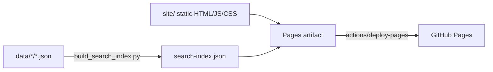

## Plan: Client-side searchable feature matrix on GitHub Pages

### Architecture decision up front

Deploy Pages **from a GitHub Actions workflow** (Pages source: "GitHub Actions"), not from a `docs/` folder on `main`. Reason: the search index is derived from data, so building it in CI and shipping it as a deployment artifact means the generated index never needs to be committed, can never go stale in git, and cannot drift from the data.



---

### Phase 1 — Search index builder (Python)

**New file: `scripts/build_search_index.py`** (runnable as `python -m scripts.build_search_index --output <dir>`)

- Iterate all IDEs from ides.yml (skip `dummy`), reusing config.py and io.py.
- For each `data/<ide>/<version>.json`, emit a compact record: `ide`, `ide_name`, `version`, `release_date`, `url`, `snippets` (from `copilot_mentions`; fall back to `body_markdown` split into bullet lines for IDEs where `copilot_mentions` is empty — verify per-IDE which field is populated).
- Normalize snippets: strip markdown heading markers/link syntax for display, but keep original text for matching.
- Write a single `search-index.json` plus a small `meta.json` (`generated_at`, per-IDE version counts) for a "last updated" footer.
- Deterministic output (sorted by IDE then version) so builds are reproducible and testable.

### Phase 2 — Static site (client-side only)

**New folder: `site/`** — `index.html`, `style.css`, `app.js`, `search.js`

- `search.js` — a **pure, dependency-free ES module** containing all business logic, so it's testable outside a browser:
  - `validateQuery(q)` — enforce the > 4 characters rule.
  - `searchIndex(index, keyword)` — case-insensitive substring match over snippets.
  - `buildMatrix(results)` — pivot to the table model: rows = matched snippets, columns = IDEs; per IDE cell shows the version(s) (and earliest version highlighted) in which the match appears, with a link to the release notes URL.
- `app.js` — DOM wiring only: fetch `search-index.json` once on load, debounce input, render the table, show snippet text on hover/expand.
- No frameworks, no build tooling, no npm dependencies at runtime. Optional later upgrade to MiniSearch if substring search proves too crude — not in scope now.
- A summary row per IDE: "first version mentioning *keyword*", addressing the cross-IDE alignment nuance discussed earlier.

### Phase 3 — Testing

**Python (existing toolchain — `pytest`, `ruff`):**
- `tests/test_build_search_index.py`:
  - builds an index from fixture data files (follow the existing fixture style in tests),
  - asserts schema of emitted records, deterministic ordering, snippet fallback behavior, exclusion of `dummy`,
  - asserts the builder tolerates a missing/empty IDE data dir and malformed JSON (skip + warn, don't crash).

**JavaScript (zero new dependencies):**
- `site/search.test.mjs` run with Node's built-in test runner: `node --test site/`.
  - `validateQuery`: rejects ≤ 4 chars, trims whitespace.
  - `searchIndex`: case-insensitivity, no-match, multi-IDE matches.
  - `buildMatrix`: correct pivot, earliest-version selection, empty cells for IDEs without matches.

**Smoke validation of the built artifact (CI step, not a test file):**
- After building: `python -c` one-liner (or tiny script) asserting `search-index.json` parses, is non-empty, and every record has the required keys.

### Phase 4 — CI/CD workflow

**New file: `.github/workflows/deploy-pages.yml`**

Triggers: `push` to `main` with `paths: [data/**, site/**, scripts/**, config/ides.yml]`, plus `workflow_dispatch`. Also runs the test job (not deploy) on `pull_request` so PRs touching the site are validated.

```yaml
name: Test and deploy Pages site

on:
  push:
    branches: [main]
    paths: ['data/**', 'site/**', 'scripts/**', 'config/ides.yml']
  pull_request:
    paths: ['data/**', 'site/**', 'scripts/**', 'config/ides.yml']
  workflow_dispatch:

permissions:
  contents: read

jobs:
  test:
    runs-on: ubuntu-latest
    steps:
      - uses: actions/checkout@<sha> # vX.Y.Z
      - uses: actions/setup-python@<sha> # vX.Y.Z
        with: { python-version: '3.12' }
      - run: pip install -r requirements.txt
      - run: ruff check scripts tests
      - run: pytest
      - uses: actions/setup-node@<sha> # vX.Y.Z
        with: { node-version: '22' }
      - run: node --test site/

  build:
    needs: test
    runs-on: ubuntu-latest
    steps:
      - uses: actions/checkout@<sha> # vX.Y.Z
      - uses: actions/setup-python@<sha> # vX.Y.Z
        with: { python-version: '3.12' }
      - run: pip install -r requirements.txt
      - name: Build search index into _site
        run: |
          mkdir -p _site
          cp site/*.html site/*.css site/*.js _site/
          python -m scripts.build_search_index --output _site
      - name: Validate built index
        run: python -c "import json; d=json.load(open('_site/search-index.json')); assert d, 'empty index'"
      - uses: actions/upload-pages-artifact@<sha> # vX.Y.Z
        with: { path: _site }

  deploy:
    if: github.ref == 'refs/heads/main'
    needs: build
    runs-on: ubuntu-latest
    permissions:
      pages: write
      id-token: write
    environment:
      name: github-pages
      url: ${{ steps.deployment.outputs.page_url }}
    steps:
      - id: deployment
        uses: actions/deploy-pages@<sha> # vX.Y.Z
```

Per the repo's definition of done: before committing, look up the **absolute latest released version** of each action (`actions/checkout`, `actions/setup-python`, `actions/setup-node`, `actions/upload-pages-artifact`, `actions/deploy-pages`, and `actions/configure-pages` if used) and SHA-pin each with the version tag as a comment. Note the `deploy` job is `main`-only, mirroring the "no writes from non-default branches" convention; on PRs only `test` + `build` run, which serves as the simulate/validate path. The fetcher workflows need **no changes** — their auto-merged PRs land on `main` and the `paths` filter on `data/**` triggers a redeploy automatically.

### Phase 5 — GitHub Pages configuration (one-time, manual)

Document these steps in the README (they can't be automated with the default token):

1. Repo → **Settings → Pages** → under *Build and deployment*, set **Source = GitHub Actions** (not "Deploy from a branch").
2. Repo → **Settings → Environments** → confirm the `github-pages` environment exists (created automatically on first deploy); optionally restrict its deployment branches to `main`.
3. Repo → **Settings → Actions → General** → ensure workflow permissions allow OIDC (`id-token: write` is granted at job level in the workflow; no settings change needed unless the org restricts it).
4. First deployment: trigger `deploy-pages.yml` manually via **Actions → Test and deploy Pages site → Run workflow** on `main`.
5. Site URL will be `https://<owner>.github.io/github-copilot-ide-features/` — important: all fetches in `app.js` must use **relative paths** (`./search-index.json`) because the site is served from a sub-path, not the domain root.

### Phase 6 — Documentation (definition of done)

- **README.md**: add a "Website" section — link to the live site, how search works (>4 char keyword, substring match, table semantics), how to run the site locally (`python -m scripts.build_search_index --output site && python -m http.server -d site`).
- **AGENTS.md**: extend repository layout with `site/` and `scripts/build_search_index.py`; add `node --test site/` to the local verification step; document the Pages workflow behavior.

---

### Execution order & checklist

| # | Step | Verification |
|---|---|---|
| 1 | `scripts/build_search_index.py` + `tests/test_build_search_index.py` | `pytest`, `ruff check scripts tests` |
| 2 | `site/search.js` + `site/search.test.mjs` | `node --test site/` |
| 3 | `site/index.html`, `app.js`, `style.css` | local: build index into `site/`, serve with `http.server`, manual smoke test |
| 4 | `.github/workflows/deploy-pages.yml` with SHA-pinned latest actions | push branch → `test` + `build` jobs pass, `deploy` skipped |
| 5 | Manual Pages settings (Phase 5) + merge to `main` | site live, search returns results |
| 6 | README + AGENTS.md updates | included in same PR |

Risks worth noting: (a) if `copilot_mentions` is empty for some IDEs (e.g., CLI files show `[]` but have rich `body_markdown`), the fallback extraction in Phase 1 is essential — verify field population per IDE during step 1; (b) index size — measure it in step 1 and only add per-IDE index splitting if it exceeds ~5 MB.
